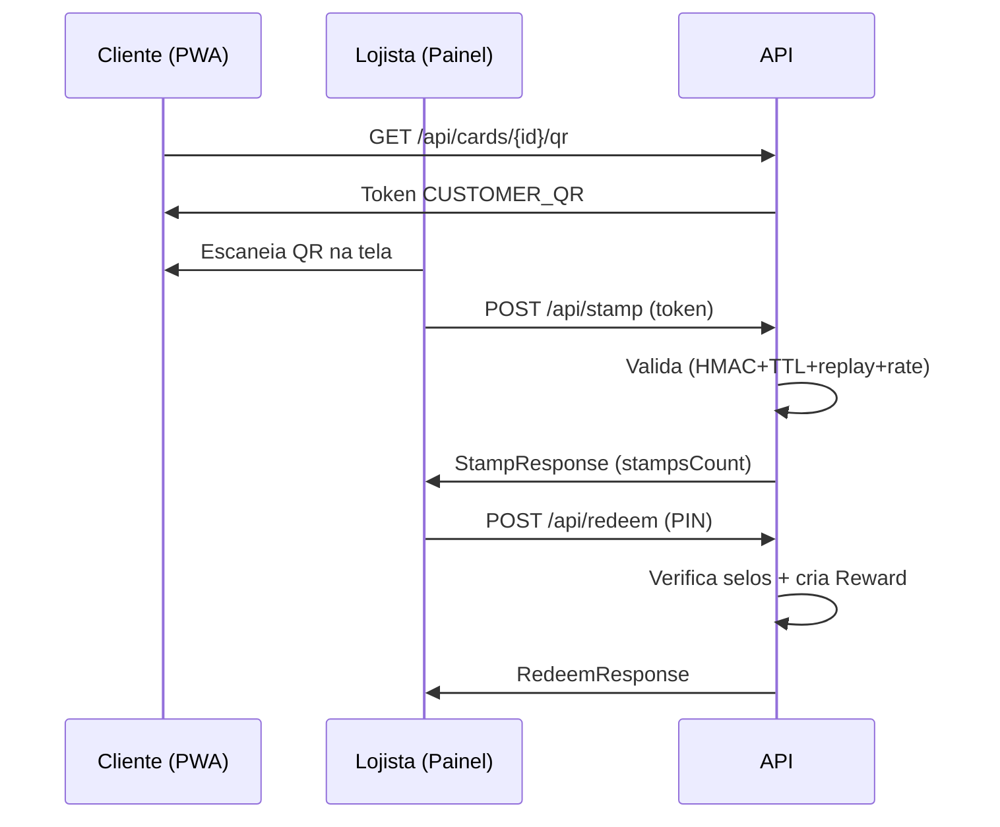

# Panorama do fluxo de carimbar (stampear) selo

Segue um panorama completo da aplicação e do fluxo de carimbar (stampear) selo.

---

## Visão Geral

- **Domínios**
  - `core`: `Merchant`, `Location`, `StaffUser`
  - `fidelity`: `Program`, `Customer`, `Card`, `Stamp`, `Reward`
  - `ops`: `StampToken`
- **Objetivo principal atual**
  - Gerar token efêmero para um cartão e consumi-lo ao aplicar um selo (fluxo A: `CUSTOMER_QR`).
- **Endpoints ativos**
  - `GET /api/cards/{id}/qr`: gera token do cliente.
  - `POST /api/stamp`: consome token e incrementa o selo.

---

## Fluxo A (`CUSTOMER_QR`)

1. **Cliente abre o cartão**  
   PWA chama `GET /api/cards/{cardId}/qr`.

2. **Geração do token**  
   `StampTokenService.issueCustomer(cardId)`:
   - Cria `nonce` (`UUID`).
   - Define `exp` = agora + 45 minutos.
   - Assina `idRef|nonce|expEpoch` via **HMAC SHA-256 base64url**.

3. **QR exibido**  
   Front mostra JSON:
   ```json
   {
     "type": "...",
     "idRef": "<cardId>",
     "nonce": "<nonce>",
     "exp": "<exp>",
     "sig": "<assinatura>"
   }
   ```

4. **Lojista escaneia**  
   Painel envia:
   ```http
   POST /api/stamp
   Content-Type: application/json
   X-Location-Id: <opcional>
   Idempotency-Key: <opcional>
   ```
   Body:
   ```json
   {
     "type": "CUSTOMER_QR",
     "payload": {
       "cardId": "...",
       "nonce": "...",
       "exp": "...",
       "sig": "..."
     }
   }
   ```

5. **Controller**  
   `StampsController`:
   - Desserializa o `payload`.
   - Chama `StampsService.handleCustomer(...)`.

6. **Passos do Service**

   - **Idempotência** (se veio chave)  
     - Evita duplicar carimbo em caso de retry.
   - **Rate limit**  
     - Chama `checkRateLimit(cardId, locationId)` (usa janela configurada, default **120s**).
   - **Validação do token**
     - Verifica expiração.
     - Valida assinatura HMAC (comparação constante).
     - Anti-replay: verifica se `nonce` já foi usado.
     - Persiste uso em `stamp_tokens`.
   - **Carga de entidades**
     - Carrega `Card` e seu `Program`.
   - **Atualização do card**
     - Incrementa `stampsCount` e salva.
   - **Criação da entidade `Stamp`**
     - Registro de auditoria: `source = A`, `location` e `userAgent` se presentes.
   - **Cálculo de `rewardIssued`**
     - `true` se `stampsCount >= ruleTotalStamps`.  
       > Obs.: ainda **não** cria `Reward` automaticamente no MVP.
   - **Retorno**
     - Retorna `StampResponse`.

---

## Segurança do Token

- **HMAC**
  - Segredo único: `carimbai.hmac-secret`.
  - Inicializa um `Mac` por thread (`ThreadLocal`).
- **TTL**
  - 45 minutos (constante `TTL` no service).
  - Validado antes do uso.
- **Anti-replay**
  - `existsByNonce(nonce)` no repositório.
  - Se já houve uso → erro.
- **Assinatura**
  - Base64 URL **sem padding**.
  - Comparação constante para mitigar timing attacks.
- **Payload coberto**
  - Somente `idRef|nonce|expEpoch`.
  - `type` fica fora da assinatura (pode ser reforçado incluindo `type` depois).

---

## Entidades Principais

- **Program**
  - Define regra (`ruleTotalStamps` etc.).
  - Usado para saber quando uma recompensa seria emitida.

- **Card**
  - Mantém `stampsCount` agregado.
  - Relação única com (`program`, `customer`).

- **Stamp**
  - Registro granular de cada carimbo.
  - Campos típicos: `source`, `location`, `userAgent`, `timestamp`.
  - Usado para auditoria e rate limit.

- **StampToken**
  - Armazena uso de cada token:
    - `nonce`, `expAt`, `usedAt`, `signature`.
  - Base para replay tracking.

- **Reward**
  - Entidade prevista.
  - Ainda não automatizada no fluxo atual.

---

## Rate Limit

- **Finalidade**
  - Impedir carimbos muito frequentes.
  - Proteção contra abuso ou dupla leitura.

- **Implementação esperada**
  - Método custom em `StampRepository`:
    - `existsRecentByCardAndLocation(cardId, locationId, since)`.
  - Se `true` → lança `TooManyStampsException` (tratável como **HTTP 429**).

---

## Idempotência

- **Uso**
  - Se o cliente (painel) manda `Idempotency-Key`, o service tenta fazer um “acquire” antes de prosseguir.
  - Evita duplicar selo em retransmissões (retries da mesma operação).

- **Observação**
  - No trecho exibido, o `idempotencyService` não aparece injetado.
  - Provável ajuste pendente:
    - Necessário incluir `IdempotencyService` no construtor do `StampsService`.

---

## Tipos de Token (A e futuro B)

- **`CUSTOMER_QR` (ativo)**
  - Cliente gera o QR.
  - Lojista consome.

- **`STORE_QR` (latente/futuro)**
  - Loja geraria o QR.
  - Cliente escanearia e enviaria ao backend junto ao contexto do cartão (inversão do fluxo).
  - Já existe:
    - `issueStore` no `StampTokenService`.
    - `case STORE_QR` placeholder (retornando **501 Not Implemented**) no controller.

---

## Principais Pontos de Erro

- Token expirado (`exp < now`).
- Assinatura inválida (chave errada ou payload modificado).
- Replay (`nonce` reutilizado).
- Rate limit (carimbo muito cedo).
- `Card` ou `Program` inexistentes.
- Conflito de idempotência (`Idempotency-Key` já usada).
- `STORE_QR` ainda não implementado (**501**).

---

## Possíveis Melhorias

- Incluir `type` na string assinada para evitar mudança de tipo com a mesma assinatura.
- Tornar `TTL` configurável (`application.yaml`) em vez de constante.
- Rotação de segredo HMAC (suporte a multi-segredo / `key id`).
- Emitir `Reward` automaticamente quando atingir o limiar.
- Consolidar resposta com `timestamp` do carimbo.
- Logging estruturado:
  - `cardId`, `nonce`, `locationId` para auditoria.
- Completar injeção do `IdempotencyService` no `StampsService`.

---

## Resumo Rápido

- `GET /api/cards/{id}/qr`
  - Gera token assinado (HMAC) com `exp` + `nonce`.
- `POST /api/stamp`
  - Valida token.
  - Aplica `+1` selo.
  - Grava auditoria.
  - Responde contagem de selos.
- **Proteções**
  - TTL.
  - Assinatura.
  - Anti-replay.
  - Rate limit.
  - Idempotência opcional.
- **Fluxo B (`STORE_QR`)**
  - Pronto para expansão, porém desativado (501).

> Se quiser, posso desenhar o fluxo B proposto em diagrama ou revisar como adicionar a criação automática de `Reward` quando o limiar for atingido.

## Controllers Adicionais

### CardsController (`GET /api/cards/{id}/qr`)
- **Função:** Emite o token efêmero do cliente para ser convertido em QR (Fluxo A).
- **Endpoint:** `GET /api/cards/{id}/qr`
- **Dependência:** `StampTokenService.issueCustomer(cardId)`.
- **Retorno:** `QrTokenResponse` (`type=CUSTOMER_QR`, `idRef=cardId`, `nonce`, `exp`, `sig`).
- **Uso típico:** PWA do cliente na tela do cartão.
- **Erros potenciais:** Card inexistente (quando validação for adicionada), segredo HMAC mal configurado, clock skew extremo.
- **Melhorias futuras:** Cache curto de token; incluir campo `issuedAt`.

### LocationsController (`GET /api/locations/{id}/qr`)
- **Função:** Emite token `STORE_QR` (Fluxo B – cliente escaneia QR da loja).
- **Checks:** Carrega `Location`; avalia flags via `LocationPolicyService.fromFlags`; requer `enableScanB=true` senão 403.
- **Retorno:** `QrTokenResponse` (`type=STORE_QR`, `idRef=locationId`, `nonce`, `exp`, `sig`).
- **Dependências:** `LocationRepository`, `LocationPolicyService`, `StampTokenService.issueStore(locationId)`.
- **Erros:** Location inexistente, política desativada, futura autenticação de merchant.
- **Melhorias:** Remover método sem mapping; audit trail (staffId); assinar também o `type`.

### RedeemController (`POST /api/redeem`)
- **Função:** Resgata recompensa quando selos suficientes.
- **Request:** `RedeemRequest(cardId, cashierId, cashierPin, locationId?)`.
- **Fluxo Interno (RedeemService):**
  1. Valida PIN do caixa (`StaffService.validateCashierPin`).
  2. (Opcional) Carrega `Location` e verifica merchant consistente.
  3. Lê `LocationPolicy` (flags); trata `requirePinOnRedeem`.
  4. Carrega `Card` + `Program`.
  5. Verifica selos suficientes (`stampsCount >= ruleTotalStamps`).
  6. Cria `Reward` (associa card, cashier, location).
  7. Zera `stampsCount` do card (MVP).
  8. Retorna `RedeemResponse(ok, rewardId, cardId, stampsAfter=0)`.
- **Erros:** PIN inválido, card/program inexistente, selos insuficientes, location de outro merchant.
- **Segurança:** BCrypt para PIN; faltam limites de tentativa.
- **Melhorias:** Idempotência; exceções específicas; versionar card em vez de zerar; logging estruturado.

### StampsController (referência já documentada)
- Consome tokens `CUSTOMER_QR` (e futuramente `STORE_QR`) aplicando selo com rate limit + anti-replay + idempotência opcional.

## Resumo dos Controllers

| Controller | Endpoint | Papel | Entrada | Saída | Segurança |
|------------|----------|-------|---------|-------|-----------|
| Cards | `GET /api/cards/{id}/qr` | Emissão token cliente (Fluxo A) | `cardId` | Token efêmero | HMAC, TTL |
| Locations | `GET /api/locations/{id}/qr` | Emissão token loja (Fluxo B) | `locationId` + flags | Token efêmero | Policy (`enableScanB`), HMAC |
| Stamps | `POST /api/stamp` | Aplicar selo via token | Token + headers | `StampResponse` | Anti-replay, Rate limit, Idempotência |
| Redeem | `POST /api/redeem` | Resgatar recompensa | PIN + card (+ location) | `RedeemResponse` | PIN, Policy |

## Conexões
- `CardsController` gera token consumido por `StampsController` (Fluxo A).
- `LocationsController` (ativado) gera token consumido por `StampsController` (Fluxo B).
- `StampsController` incrementa selos; `RedeemController` consome selos para criar `Reward`.
- `LocationPolicyService` influencia emissão (Locations) e resgate (Redeem).
- `StaffService` valida PIN para resgate; pode ser estendido para emissão de QR.

## Melhorias Gerais Propostas
- Assinar também o `type` nos tokens.
- Idempotência no resgate (`Idempotency-Key`).
- Exceções específicas mapeadas para HTTP (403, 409, 422, 429).
- Rotação de segredo HMAC (key id).
- Limite de tentativas de PIN (rate limiting por cashier).
- Versionamento de `Card` ao invés de zerar selos.
- Auditoria estruturada (rewardId, cashierId, locationId, nonce).
- Diagrama Mermaid dos fluxos A e B.
- Tabela de status HTTP esperados por operação.

## Diagrama (Mermaid) – Visão Simplificada


> Futuro Fluxo B adiciona: `GET /api/locations/{id}/qr` + `POST /api/stamp (STORE_QR)` pelo cliente.


